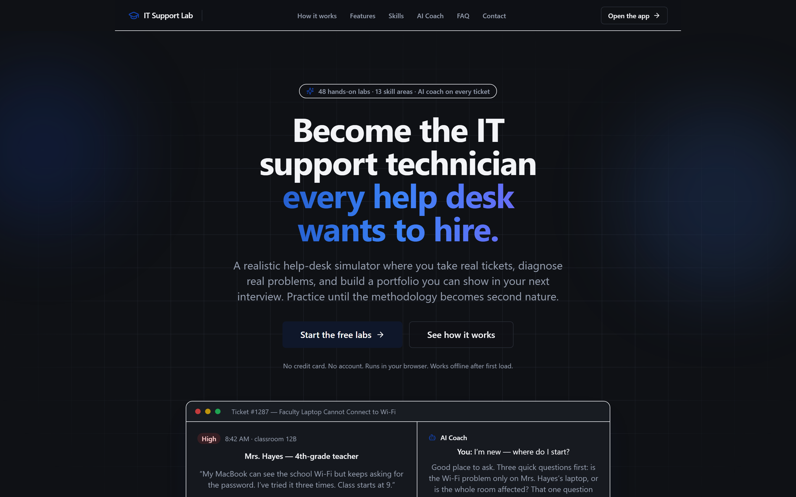
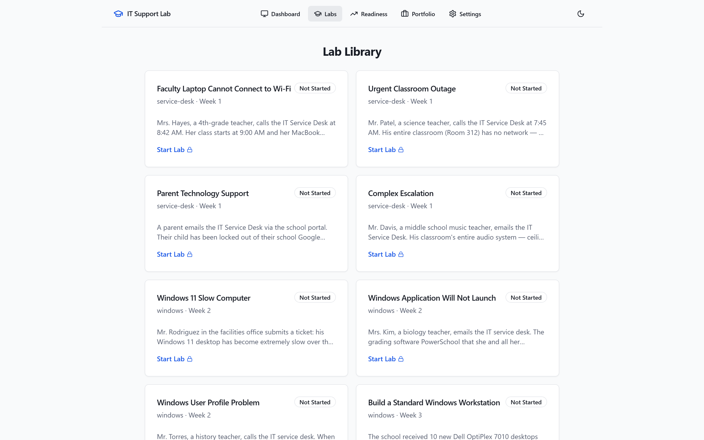

# IT Support Lab

An interactive training environment for aspiring IT Support Technicians. Work through 48 hands-on lab scenarios — password resets, hardware diagnostics, network troubleshooting, and more — guided by a built-in AI tutor. Your progress is tracked across 13 skill areas, and everything you complete builds toward a portfolio you can export.

> **Note** — this repository ships an application, not a content-only curriculum. See `src/data/labs/content/` for the 48 authored lab JSONs and `src/data/labs/lab.schema.ts` for the canonical shape.

## Quick start

```bash
pnpm install
pnpm dev          # http://localhost:5173
pnpm test         # 134 Vitest unit tests
pnpm test:e2e     # 13 Playwright browser tests
pnpm build        # production build to dist/
pnpm validate-labs
```

Requires Node 20+ and pnpm 10.

## Screenshots

| | |
|---|---|
|  |  |
| **Landing page** — your home base | **Lab browser** — filter by track and week |

## Downloads

Download the Windows app and run it without a browser. Latest release: **[v0.2.0](https://github.com/pitchiluxe/IT-Support-Lab/releases/tag/v0.2.0)**.

- [IT-Support-Lab-Setup-0.2.0.exe](https://github.com/pitchiluxe/IT-Support-Lab/releases/download/v0.2.0/IT-Support-Lab-Setup-0.2.0.exe) — installer (135 MB)
- [IT Support Lab 0.2.0.exe](https://github.com/pitchiluxe/IT-Support-Lab/releases/download/v0.2.0/IT.Support.Lab.0.2.0.exe) — portable, no-install (244 MB)

## Optional: 3D campus

The 3D campus view is gated behind `VITE_ENABLE_3D`. When it's off (the default), the 2D location panel is the only rendering. When it's on, learners can opt in via **Settings → Campus view → 3D**.

```bash
VITE_ENABLE_3D=true pnpm dev
```

`?mode=3d` in the URL forces 3D for that load; `?mode=2d` forces 2D. The user's saved preference is stored in the `settings` Dexie table under the key `campusMode`.

## Deployment

The app is a static SPA — any host that serves `dist/` will work. `netlify.toml` is provided for the easiest path:

1. Push to GitHub.
2. In Netlify, "Add new site" → "Import an existing project" → pick the repo.
3. Netlify auto-detects `netlify.toml`; the build command is `pnpm build` and the publish dir is `dist/`.
4. (Optional) In **Site settings → Environment variables**, set `VITE_ENABLE_3D=true` if you want 3D mode available to learners.

`netlify.toml` includes the SPA rewrite (`/* → /index.html` with status 200) and reasonable security headers (X-Frame-Options, X-Content-Type-Options, Referrer-Policy).

For other hosts, the equivalent setup is:
- **Vercel** — `vercel.json` with the same rewrite, or use Vercel's automatic SPA detection.
- **Cloudflare Pages** — set the build command to `pnpm build` and the output dir to `dist/`; add a `_redirects` file with `/* /index.html 200`.
- **S3 + CloudFront** — upload `dist/`, configure error document = `index.html` for SPA routing, set long cache on `/assets/*` and no-cache on `/index.html`.

## Continuous integration

`.github/workflows/ci.yml` runs on every push and pull request:

1. `unit` job — `pnpm install`, `pnpm validate-labs`, `pnpm test`, `pnpm build`.
2. `e2e` job (depends on `unit`) — `pnpm test:e2e` with Playwright's bundled Chromium. Uploads the Playwright report as an artifact on failure.

Dependabot is configured in `.github/dependabot.yml` for weekly pnpm update PRs. `@react-three/*` is held back automatically because of the React 18/19 major-version split.

## Architecture

See `CLAUDE.md` for the full layout (routing, lab engine, scoring, tutor, persistence, 3D campus, readiness, portfolio, capstone gate).

Key entry points:
- `src/app/router.tsx` — routes (`/`, `/labs`, `/lab/:id`, `/readiness`, `/portfolio`, `/settings`).
- `src/data/labs/manifest.ts` — single source of truth for the 48-lab manifest.
- `src/features/lab-engine/` — FSM, run loop, evidence/decisions.
- `src/features/scoring/` — rubric + readiness engine.
- `src/features/tutor/` — Ollama (default) and Fake (offline) providers.
- `src/features/capstone/gate.ts` — capstone unlock logic, threshold configurable.
- `src/lib/db/client.ts` — Dexie singleton, 22 tables, DB name `itsla`.

## Reset local state

```js
// In the browser devtools console:
indexedDB.deleteDatabase('itsla');
location.reload();
```

## License

Internal curriculum. All scenarios are fictional.
